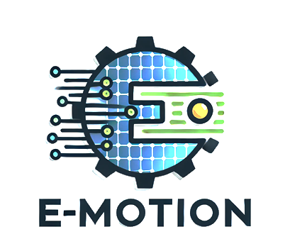
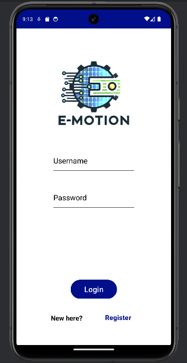
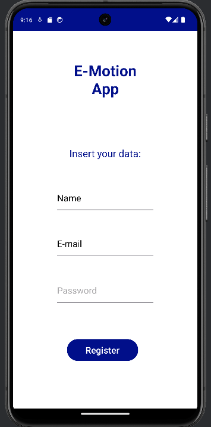
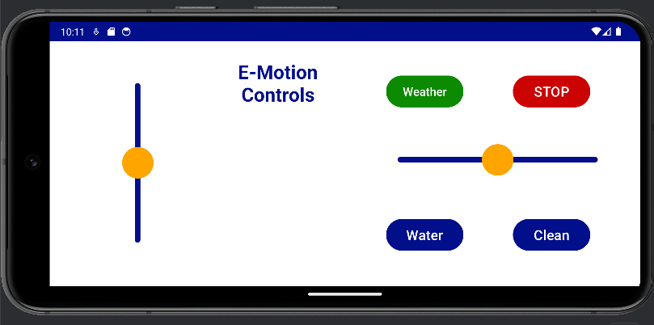
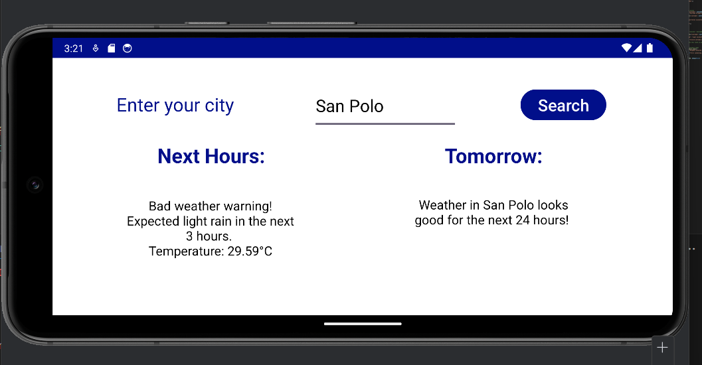

# E-Motion Application (Prototype)

## Overview

**E-Motion App** is developed with the aim of providing users with an intuitive and functional interface for the remote control of a robot specialized in cleaning solar panels.

## Features

- **Controls screen** You will be able to maneuver the robot via the interactive controls, use the clean, water, weather and emergency stop button.
- **Login Page** Verify that you have credentials to access the system.
- **Registration** Ability to create a new user account to obtain new valid credentials.
- **Weather Interface:** Weather conditions can be checked for optimal cleaning planning.
- **User-friendly Interfaces:** Simple and clean design for a seamless user experience.
- **Synchronization:** Sync your data across multiple devices.

## Technologies Used

- **Communication protocol**: Bluetooth
- **Android Dev language** Kotlin
- **Development IDE** Android Studio
- **Backend server:** Flask
- **Database:** MongoDB
- **APIs:** OpenWeatherAPI

## Screenshots

### Home Screen (Login)

### Register page

### Control interface

### Weather Screen

## Get Started

It is recommended to read the user manual (E-MotionDoc en.pdf) to test the operation of the application. 
It should be remembered that the app is still in prototype version, which is why an apk has not yet been released and the associated server has not yet been made public.

## Contacts

For any inquiries, feedback, or support, please contact me.
